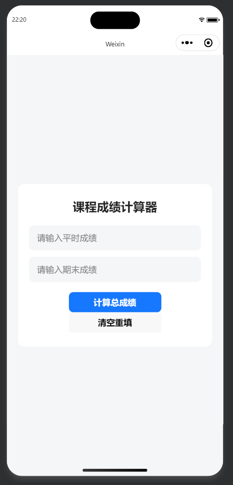
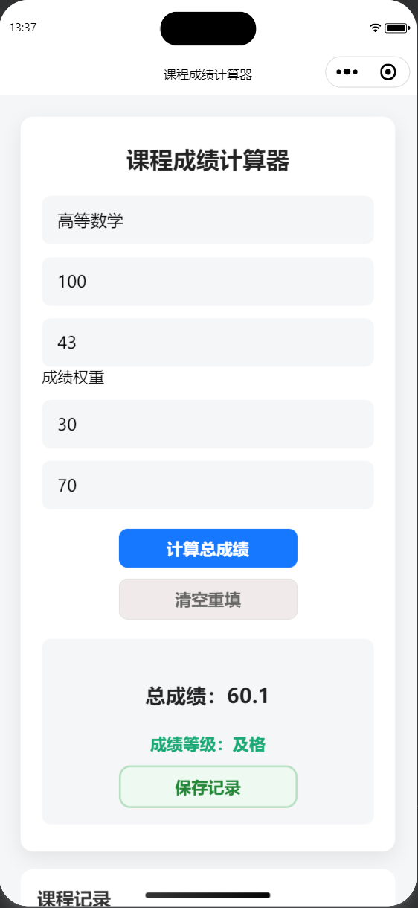
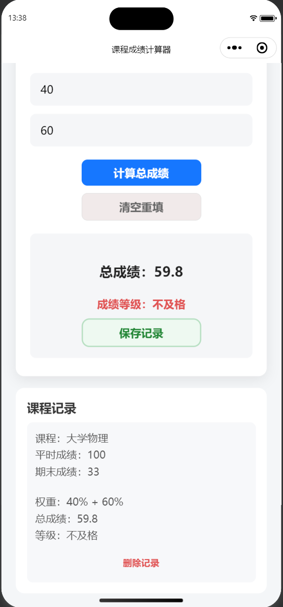
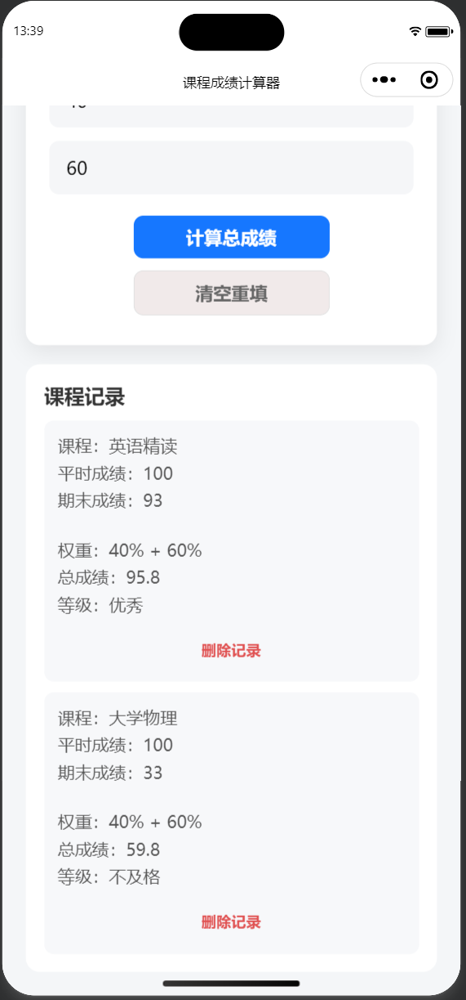

# GradeCalculator Mini Program

A lightweight WeChat Mini Program for calculating weighted course grades and managing calculation history.

Built with native WeChat Mini Program technologies, including JavaScript, WXML, WXSS, and local storage APIs.

## Features

- Calculate weighted course grades
- Customize coursework and final exam weights
- Validate scores and weight inputs
- Automatically classify grade levels
- Save course calculation history
- Persist records with local storage
- Delete individual course records
- Clear the form for a new calculation
- Clean and lightweight interface

## Grade Classification

| Final Score | Grade Level |
|---:|---|
| 90–100 | Excellent |
| 80–89.9 | Good |
| 70–79.9 | Average |
| 60–69.9 | Pass |
| Below 60 | Fail |

## Calculation

The final score is calculated using user-defined weights:

```text
Final Score =
Coursework Score × Coursework Weight
+ Final Exam Score × Final Exam Weight
```

For example, with weights of 40% and 60%:

```text
Final Score =
Coursework Score × 0.4
+ Final Exam Score × 0.6
```

The coursework weight and final exam weight must add up to 100%.

## Tech Stack

- JavaScript
- WXML
- WXSS
- JSON
- WeChat Mini Program APIs
- Local Storage

## Project Structure

```text
GradeCalculator-MiniProgram
├── pages
│   └── index
│       ├── index.js
│       ├── index.json
│       ├── index.wxml
│       └── index.wxss
├── screenshots
│   ├── home.png
│   ├── result01.png
│   ├── record01.png
│   └── record02.png
├── app.js
├── app.json
├── app.wxss
├── project.config.json
└── sitemap.json
```

## Screenshots

### Home Page



### Calculation Result



### Saved Course Record



### Multiple Course Records



## Local Storage

Course records are stored locally with the WeChat Mini Program storage API:

```js
wx.setStorageSync('courseRecords', records)
```

Records remain in the current device or development environment. They are not uploaded to GitHub with the source code.

## Getting Started

1. Clone or download this repository.
2. Open WeChat Developer Tools.
3. Select **Import Project**.
4. Choose the project directory.
5. Use your own AppID or a test account.
6. Compile and run the project.

## Current Limitations

- Records are stored locally and cannot sync across devices.
- Existing records cannot currently be edited.
- GPA calculation is not yet available.
- Data visualization is not yet supported.

## Roadmap

- [ ] Add a clear-all history action
- [ ] Support editing saved records
- [ ] Add average score and GPA calculation
- [ ] Add score statistics and visualization
- [ ] Explore cloud database synchronization

## Learning Goals

This project was developed as a hands-on exercise in:

- WeChat Mini Program architecture
- Data binding and event handling
- JavaScript objects and arrays
- Form validation and control flow
- Conditional rendering and list rendering
- Local data persistence
- Git and GitHub version management

## Author

**ditto**
